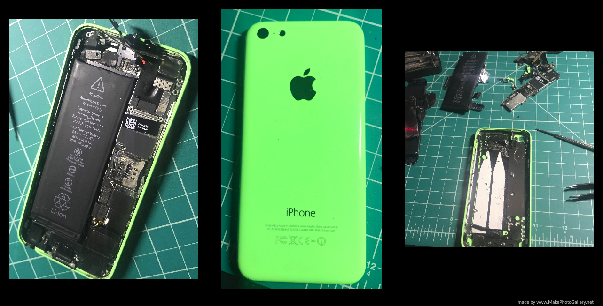

<h1> Reverse-Engineered-iPhone-5C </h1>

<h2>Tools</h2>
<ul>
  <li>Tweezers</li>
  <li>Screw Driver Set for Small Phone Screws</li>
  <li>Plastic Bag for Discarding of Components</li>
  <li>Magnifying Glass to Read Text on Components</li>
</ul>  

<h2>Motivation for the Project</h2>
During my winter break, I decided to open my iPhone 5C, which I had since freshman year in high 
school until I dropped it on the garage floor and the front screen completely shattered. However, 
out of curiosity and an attempt to understand how iPhones are designed I got my screwdrivers and 
tweezers out to begin disassembling. I got the cameras out first, but I could not salvage them as 
it would not be compatible with my Raspberry Pi. I then took out all the components from the speakers 
to the circuit boards, but I did not think to take off the covers on the circuit boards, so I just 
studied the lithium battery and speakers. However, in the end I discarded all the parts safely by 
putting them in a plastic bag and disposing them at the Electronic Waste area at Best Buy. Although, 
unsatisfied at only seeing the battery, cameras, and speakers I know next time I will take more time 
to take account of the names of components and research them me thoroughly.
